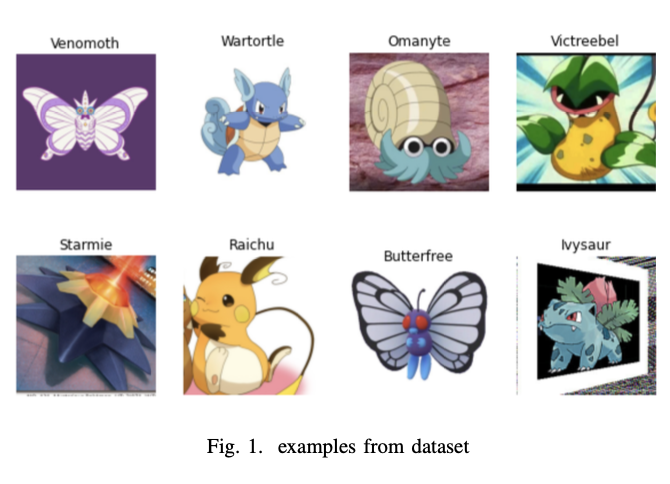
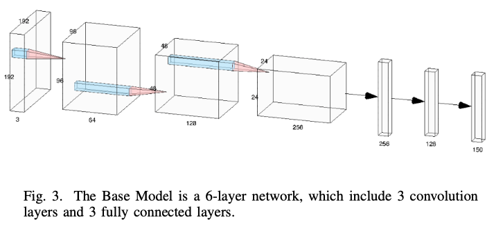
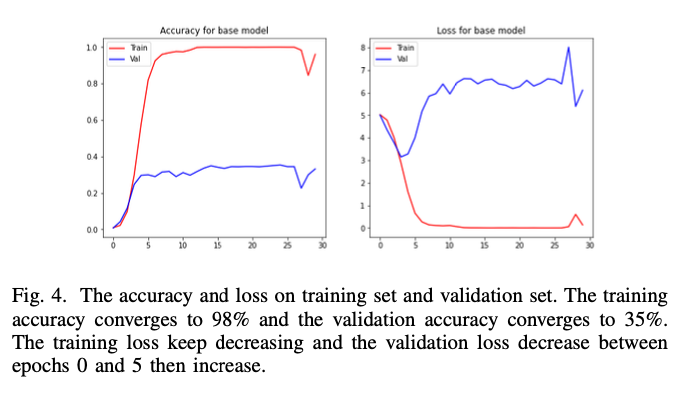
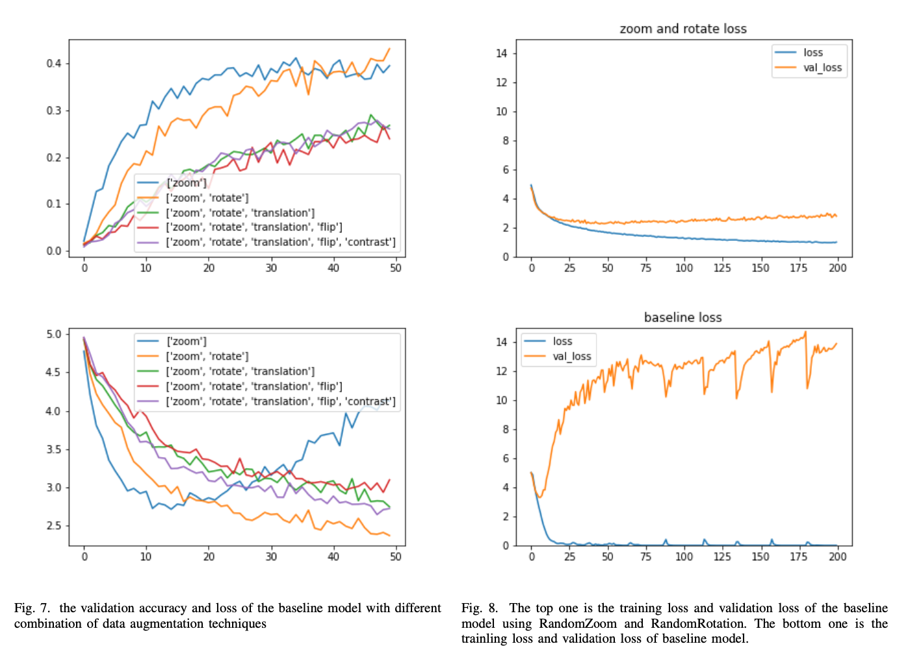
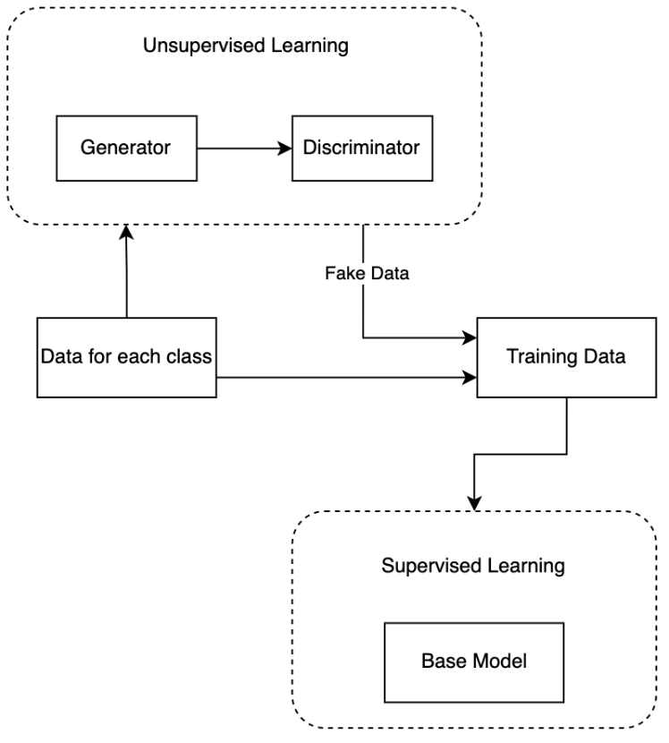
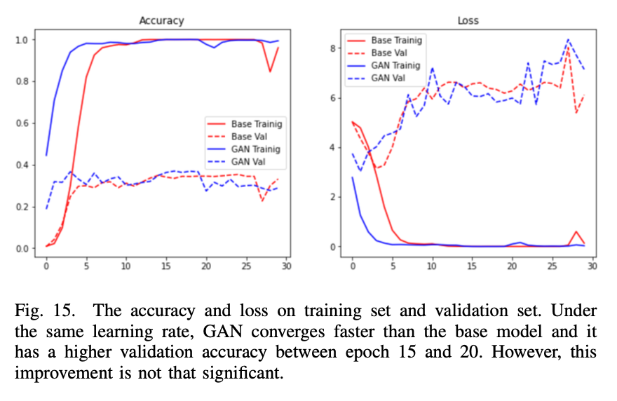
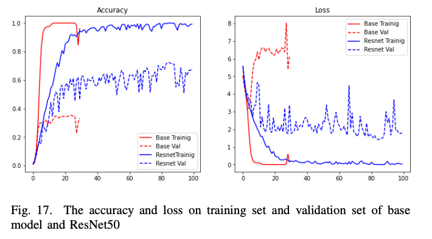
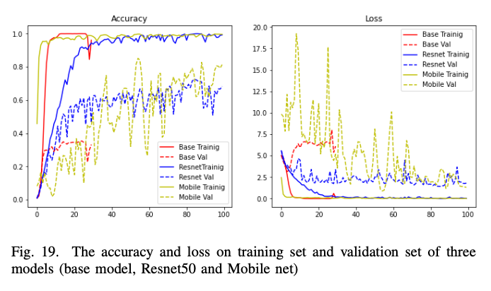
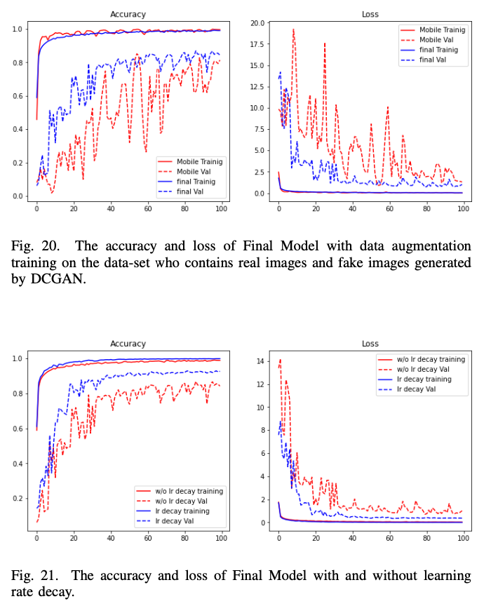

# 7000 labeled pokemon classification

- [DataSet](#dataset)
- [Methodology](#methodology)
  - [First attempt: Base Model](#first-attempt-base-model)
  - [Data Argumentation](#data-argumentation)
  - [GAN](#gan)
  - [Going to a deeper model:](#going-to-a-deeper-model)
    - [Resnet50:](#resnet50)
    - [MobileNet:](#mobilenet)
  - [Final Model:](#final-model)
- [Conclusion:](#conclusion)

# DataSet

Our dataset is from the Kaggle website [1], maintained and owned by Lance Zhang. Most of the images from this dataset are imported from another dataset on Kaggle [6]. Lance Zhang went through all these images, and modified them so that all images are labelled correctly and applicable for machine learning. Based on the description from the website, there are 7,000 labeled and hand-cropped Pokemon images with 150 classes of which the class names are also the name of 
pokemons. In addition, each class contains 25-50 images with the pokemon in the center. Most of them have relatively high quality and all perfect for light deep learning. Before loading these datas to our model, we do some preprocessing on the dataset. we resize all the images to (192, 192, 3). Moreover, passing large pixel values to the model causes the process to be complex, and thus we normalize all the pixel values to range from 0 to 1. According to Fig. 2 which is the plot of count of images, we can see that some classes have more than 60 images, but some only have about 25, less than the half of the largest. We can see that the number of images among different classes are unbalanced. But based on the cases mentioned in [7], it is not a problem in this case. However, we will try to fix this using generative adversarial neural network (GAN) which would be discussed below in detail.
For the images in each class, we split them into three sets: 70% for the training set, 10% for the validation set, 20% for the test set. Training set and validation set are used for training models, and test sets are used to evaluate our models.

     

# Methodology

Since the data we have is image data and the CNN (con- volution neural network) performs well on the image data. So we decide to construct a CNN model to fit on the training data.

## First attempt: Base Model
In this section of work, we constructed a base model which has 3 convolution layers with 3 × 3 filter size and 3 fully connected layers as in figure 3. We use Adam as our optimizer with learning rate equals to 0.001, and we define the cross entropy loss as our loss function.

     

Since the the number of images for each class is relatively low, therefore, in the first place, we believe a simple neural network is sufficient for us to have a good performance on both training set and validation set.

     

## Data Argumentation
What we will discuss here are RandomFlip, RandomRota- tion, RandomContrast, RandomZoom and RandomTranslation.

• RandomFlip: Randomly flip the image horizontally or vertically.

• RandomRotation: Randomly rotate the image within a specified range

• RandomContrast: Adjust the contrast of the image with a random factor
• RandomZoom: Randomly zoom in or zoom out the image with a random factor

• RandomTranslation: Randomly shift the image vertically and horizontally within a specified range and then the points outside the boundaries of the input are filled according to the given mode, and for this project, we choose the “nearest” mode which is also applied for the RandomRotate and RandomZoom techniques.

     

## GAN
After applying Data augmentation to our model, we checked our data set, we found out approximately 20% of our class only has 30 images or below, we then take a guess, since the number of training images for some classes is too low, this may be the reason that limits our model to have better accuracy.

In this section of work, we propose a pipeline described in figure above that works on the original training set without an additional data collection process. First we use a network structure called DCGAN [11] run 4000 epochs to generate 36 fake images for each class, these fake images are labeled as same as the class label. Then we saved the fake image generated by the generator to our training data. Finally we will run the base model on the new training data and compare the loss and accuracy on both training set and validation set, this idea was inspire by Unlabeled Samples Generated by GAN Improve the Person Re-identification Baseline in vitro [12].

     

The DCGAN is implemented in following url:

https://github.com/bochendong/Pokemon_gan

As a result, the new data set generated by GAN does not have a significant improvement. As we can see in the figure 15, our model converge very fast and achieve 98% accuracy on the training set. However, the accuracy on the validation set is still low. We believe GAN can achieve a better performance after we overcome above challenges, and we will do this in the future work.

     

## Going to a deeper model:
After we made these attempts, we begin to consider why the validation accuracy is still low. we thought it might be that the complexity of the model itself is too low, therefore when the base model tries to fit a more complex classification problem, it can only memorize the data and understand poorly about the meaning and connection between the images and their label. Therefore, we decided to try a deeper network structure to see if it can have a better performance. We tried VGG16 in the first place, and we use different learning rates and different loss functions, but the VGG does not perform well on a small dataset. So we then considered resnet50.

### Resnet50:

     

### MobileNet:

     

## Final Model:

In this section we will train a mobile-net and apply the techniques we talked about above. Since the data augmentation has a significant improvement, we will apply random rotation and random zoom in our model. Then as we described in the section above, Mobile net is very unstable during training, this may because the learning rate is relatively large, Therefore we will try learning rate decay after data augmentation.

     

# Conclusion:

In conclusion, our project shows the basic knowledge of using CNNs to do image classification. We study and analyze different techniques used to address the overfitting problem which is common in machine learning, and verify that adding dropout layers, data augmentation can reduce the overfitting. Especially, when the number of examples in each class are unbalanced or number of examples in a specific class is extremely low, using GAN to generate more new examples can help to increase the accuracy and address the overfitting problem. In addition, choosing a model with deeper archi- tecture can increase the capacity of the model to perform well, however, at the same time, the deeper model may cause overfitting which is greatly addressed by approaches mentioned above. For our final model, we choose Mobile Net as our basic architecture, use GAN to generate more examples to our training dataset, and then add dropout layers, data augmentation contains RandomZoom and RandomRota- tion. This model has great performance and achieves 91.23% accuracy on the test dataset. However, our GAN has a horrible performance which is not expected, because it always produces the same image from the original training dataset. That is it just memorizes and does not generate, and suffers mode collapse [10]. Therefore, in the future, we need to improve our GAN model to generate new and useful images, and test the data augmentation, dropout layers and learning rate to choose the most capable one. In addition, we will try to analyze the effect of regularization which is another technique to address the overfitting problem.
